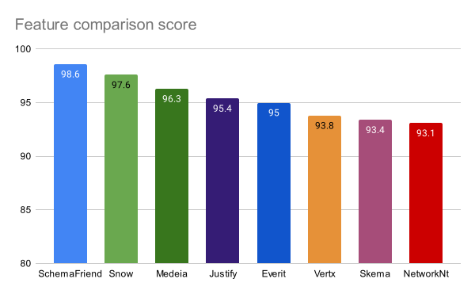
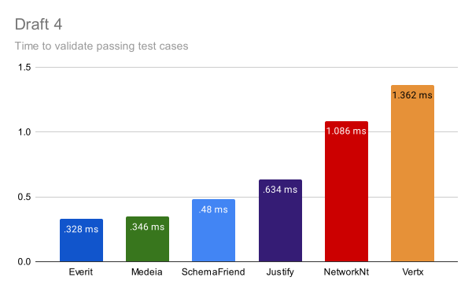
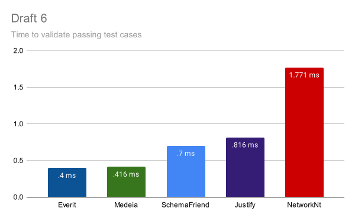
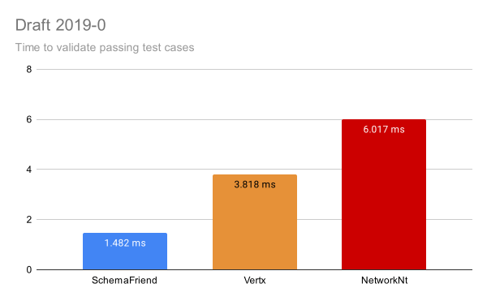
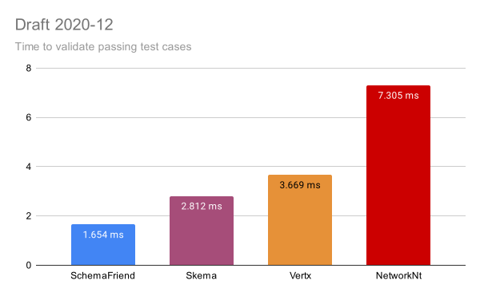
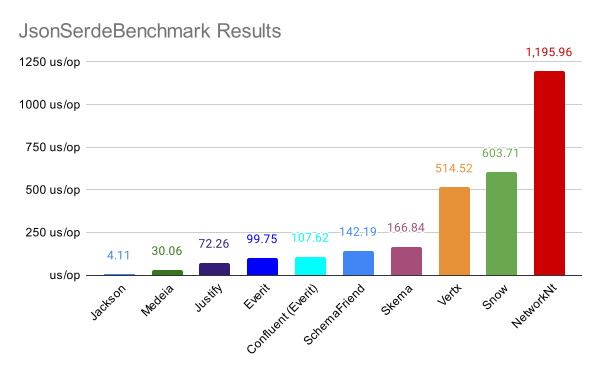

[](https://opensource.org/licenses/Apache-2.0)
[](https://github.com/creek-service/json-schema-validation-comparison/actions/workflows/build.yml)

# JSON Schema Validation comparison

Feature and performance comparison of different JVM-based implementations of JSON schema validators.

## Schema validator implementations

This repo tests the following implementations of JSON schema validation:

| Implementation under test            | Written In | Supported JSON schema specifications     | License                                |
|--------------------------------------|------------|------------------------------------------|----------------------------------------|
| [Vert.x Json Schema][1]              | Java       | 2020-12, 2019-09 draft-07, -04           | Apache License 2.0                     |
| [jsonschemafriend][2]                | Java       | 2020-12, 2019-09 draft-07, -06, -04, -03 | Apache License 2.0                     |
| [networknt/json-schema-validator][3] | Java       | 2020-12, 2019-09 draft-07, -06, -04      | Apache License 2.0                     |
| [Snow][4]                            | Java       | 2019-09 draft-07, -06                    | GNU Affero General Public License v3.0 |
| [everit-org/json-schema][5]          | Java       | draft-07, -06, -04                       | Apache License 2.0                     |
| [Justify][6]                         | Java       | draft-07, -06, -04                       | Apache License 2.0                     |
| [worldturner/medeia-validator][7]    | Kotlin     | draft-07, -06, -04                       | Apache License 2.0                     |
| [erosb/json-sKema][8]                | Kotlin     | 2020-12                                  | MIT                                    |

## Note to maintainers

If you are the maintainer of one of the above implementations, please feel free to raise a PR if you feel your
implementation is poorly represented due to issues with the code in this repo.

## Feature comparison

Run the feature comparison locally with `./gradlew runFunctionalTests`, or view previous runs on [GitHub][functionalTestRuns].

Runs each implementation through the standard [JSON Schema Test Suite][JSON-Schema-Test-Suite].
The suite contains both positive and negative test cases, i.e. JSON that should both pass and fail validation,
and covers all schema specifications, i.e. draft-03 through to the latest.

Running the testing will output one table for each implementation and supported schema specification combination, 
showing the number of test cases that pass and fail in each test file.

For example, 

Medeia: DRAFT_07:

| suite                                      | pass | fail | total |
|--------------------------------------------|------|------|-------|
| additionalItems.json                       | 18   | 0    | 18    |
| additionalProperties.json                  | 16   | 0    | 16    |
| allOf.json                                 | 30   | 0    | 30    |
| anyOf.json                                 | 18   | 0    | 18    |
| boolean_schema.json                        | 18   | 0    | 18    |
| const.json                                 | 50   | 0    | 50    |
| contains.json                              | 21   | 0    | 21    |
| default.json                               | 7    | 0    | 7     |
| definitions.json                           | 2    | 0    | 2     |
| dependencies.json                          | 33   | 3    | 36    |
| enum.json                                  | 33   | 0    | 33    |
| exclusiveMaximum.json                      | 4    | 0    | 4     |
| exclusiveMinimum.json                      | 4    | 0    | 4     |
| format.json                                | 102  | 0    | 102   |
| id.json                                    | 7    | 0    | 7     |
| if-then-else.json                          | 26   | 0    | 26    |
| infinite-loop-detection.json               | 2    | 0    | 2     |
| items.json                                 | 28   | 0    | 28    |
| maxItems.json                              | 6    | 0    | 6     |
| maxLength.json                             | 7    | 0    | 7     |
| maxProperties.json                         | 10   | 0    | 10    |
| maximum.json                               | 8    | 0    | 8     |
| minItems.json                              | 6    | 0    | 6     |
| minLength.json                             | 7    | 0    | 7     |
| minProperties.json                         | 8    | 0    | 8     |
| minimum.json                               | 11   | 0    | 11    |
| multipleOf.json                            | 10   | 0    | 10    |
| not.json                                   | 12   | 0    | 12    |
| oneOf.json                                 | 27   | 0    | 27    |
| optional/bignum.json                       | 9    | 0    | 9     |
| optional/content.json                      | 10   | 0    | 10    |
| optional/cross-draft.json                  | 1    | 1    | 2     |
| optional/ecmascript-regex.json             | 55   | 19   | 74    |
| optional/float-overflow.json               | 1    | 0    | 1     |
| optional/format/date-time.json             | 23   | 2    | 25    |
| optional/format/date.json                  | 47   | 0    | 47    |
| optional/format/email.json                 | 11   | 4    | 15    |
| optional/format/hostname.json              | 18   | 0    | 18    |
| optional/format/idn-email.json             | 8    | 2    | 10    |
| optional/format/idn-hostname.json          | 38   | 13   | 51    |
| optional/format/ipv4.json                  | 14   | 1    | 15    |
| optional/format/ipv6.json                  | 29   | 11   | 40    |
| optional/format/iri-reference.json         | 13   | 0    | 13    |
| optional/format/iri.json                   | 14   | 1    | 15    |
| optional/format/json-pointer.json          | 38   | 0    | 38    |
| optional/format/regex.json                 | 8    | 0    | 8     |
| optional/format/relative-json-pointer.json | 15   | 3    | 18    |
| optional/format/time.json                  | 39   | 6    | 45    |
| optional/format/unknown.json               | 7    | 0    | 7     |
| optional/format/uri-reference.json         | 13   | 0    | 13    |
| optional/format/uri-template.json          | 9    | 1    | 10    |
| optional/format/uri.json                   | 26   | 0    | 26    |
| optional/non-bmp-regex.json                | 12   | 0    | 12    |
| pattern.json                               | 9    | 0    | 9     |
| patternProperties.json                     | 23   | 0    | 23    |
| properties.json                            | 27   | 1    | 28    |
| propertyNames.json                         | 13   | 0    | 13    |
| ref.json                                   | 76   | 0    | 76    |
| refRemote.json                             | 21   | 0    | 21    |
| required.json                              | 16   | 0    | 16    |
| type.json                                  | 80   | 0    | 80    |
| uniqueItems.json                           | 69   | 0    | 69    |
| unknownKeyword.json                        | 3    | 0    | 3     |

Followed by a table containing a summary of pass/fail rates of required/optional test cases for each implementation, 
per supported JSON schema version. 

For example:

| Impl         | Overall                                 | DRAFT_03                          | DRAFT_04                            | DRAFT_06                            | DRAFT_07                            | DRAFT_2019_09                        | DRAFT_2020_12                         |
|--------------|-----------------------------------------|-----------------------------------|-------------------------------------|-------------------------------------|-------------------------------------|--------------------------------------|---------------------------------------|
| NetworkNt    | pass: r:4429 o:1980 / fail: r:221 o:302 |                                   | pass: r:579 o:224 / fail: r:10 o:19 | pass: r:768 o:268 / fail: r:20 o:35 | pass: r:848 o:438 / fail: r:24 o:84 | pass: r:1118 o:521 / fail: r:73 o:81 | pass: r:1116 o:529 / fail: r:94 o:83  |
|              | r:95.2% o:86.8% / r:4.8% f:13.2%        |                                   | r:98.3% o:92.2% / r:1.7% f:7.8%     | r:97.5% o:88.4% / r:2.5% f:11.6%    | r:97.2% o:83.9% / r:2.8% f:16.1%    | r:93.9% o:86.5% / r:6.1% f:13.5%     | r:92.2% o:86.4% / r:7.8% f:13.6%      |
|              | score: 93.1                             |                                   | score: 96.8                         | score: 95.2                         | score: 93.9                         | score: 92.0                          | score: 90.8                           |
| Skema        | pass: r:1184 o:490 / fail: r:26 o:122   |                                   |                                     |                                     |                                     |                                      | pass: r:1184 o:490 / fail: r:26 o:122 |
|              | r:97.9% o:80.1% / r:2.1% f:19.9%        |                                   |                                     |                                     |                                     |                                      | r:97.9% o:80.1% / r:2.1% f:19.9%      |
|              | score: 93.4                             |                                   |                                     |                                     |                                     |                                      | score: 93.4                           |
| Medeia       | pass: r:2237 o:928 / fail: r:12 o:140   |                                   | pass: r:585 o:205 / fail: r:4 o:38  | pass: r:784 o:265 / fail: r:4 o:38  | pass: r:868 o:458 / fail: r:4 o:64  |                                      |                                       |
|              | r:99.5% o:86.9% / r:0.5% f:13.1%        |                                   | r:99.3% o:84.4% / r:0.7% f:15.6%    | r:99.5% o:87.5% / r:0.5% f:12.5%    | r:99.5% o:87.7% / r:0.5% f:12.3%    |                                      |                                       |
|              | score: 96.3                             |                                   | score: 95.6                         | score: 96.5                         | score: 96.6                         |                                      |                                       |
| Snow         | pass: r:2810 o:1354 / fail: r:41 o:73   |                                   |                                     | pass: r:778 o:291 / fail: r:10 o:12 | pass: r:864 o:499 / fail: r:8 o:23  | pass: r:1168 o:564 / fail: r:23 o:38 |                                       |
|              | r:98.6% o:94.9% / r:1.4% f:5.1%         |                                   |                                     | r:98.7% o:96.0% / r:1.3% f:4.0%     | r:99.1% o:95.6% / r:0.9% f:4.4%     | r:98.1% o:93.7% / r:1.9% f:6.3%      |                                       |
|              | score: 97.6                             |                                   |                                     | score: 98.1                         | score: 98.2                         | score: 97.0                          |                                       |
| Everit       | pass: r:2192 o:934 / fail: r:57 o:134   |                                   | pass: r:579 o:214 / fail: r:10 o:29 | pass: r:765 o:275 / fail: r:23 o:28 | pass: r:848 o:445 / fail: r:24 o:77 |                                      |                                       |
|              | r:97.5% o:87.5% / r:2.5% f:12.5%        |                                   | r:98.3% o:88.1% / r:1.7% f:11.9%    | r:97.1% o:90.8% / r:2.9% f:9.2%     | r:97.2% o:85.2% / r:2.8% f:14.8%    |                                      |                                       |
|              | score: 95.0                             |                                   | score: 95.7                         | score: 95.5                         | score: 94.2                         |                                      |                                       |
| SchemaFriend | pass: r:5049 o:2311 / fail: r:34 o:82   | pass: r:433 o:104 / fail: r:0 o:7 | pass: r:588 o:233 / fail: r:1 o:10  | pass: r:785 o:293 / fail: r:3 o:10  | pass: r:869 o:505 / fail: r:3 o:17  | pass: r:1187 o:584 / fail: r:4 o:18  | pass: r:1187 o:592 / fail: r:23 o:20  |
|              | r:99.3% o:96.6% / r:0.7% f:3.4%         | r:100.0% o:93.7% / r:0.0% f:6.3%  | r:99.8% o:95.9% / r:0.2% f:4.1%     | r:99.6% o:96.7% / r:0.4% f:3.3%     | r:99.7% o:96.7% / r:0.3% f:3.3%     | r:99.7% o:97.0% / r:0.3% f:3.0%      | r:98.1% o:96.7% / r:1.9% f:3.3%       |
|              | score: 98.6                             | score: 98.4                       | score: 98.8                         | score: 98.9                         | score: 98.9                         | score: 99.0                          | score: 97.8                           |
| Vertx        | pass: r:3741 o:1672 / fail: r:121 o:307 |                                   | pass: r:578 o:219 / fail: r:11 o:24 |                                     | pass: r:855 o:427 / fail: r:17 o:95 | pass: r:1159 o:510 / fail: r:32 o:92 | pass: r:1149 o:516 / fail: r:61 o:96  |
|              | r:96.9% o:84.5% / r:3.1% f:15.5%        |                                   | r:98.1% o:90.1% / r:1.9% f:9.9%     |                                     | r:98.1% o:81.8% / r:1.9% f:18.2%    | r:97.3% o:84.7% / r:2.7% f:15.3%     | r:95.0% o:84.3% / r:5.0% f:15.7%      |
|              | score: 93.8                             |                                   | score: 96.1                         |                                     | score: 94.0                         | score: 94.2                          | score: 92.3                           |
| Justify      | pass: r:2133 o:1036 / fail: r:116 o:32  |                                   | pass: r:557 o:236 / fail: r:32 o:7  | pass: r:750 o:296 / fail: r:38 o:7  | pass: r:826 o:504 / fail: r:46 o:18 |                                      |                                       |
|              | r:94.8% o:97.0% / r:5.2% f:3.0%         |                                   | r:94.6% o:97.1% / r:5.4% f:2.9%     | r:95.2% o:97.7% / r:4.8% f:2.3%     | r:94.7% o:96.6% / r:5.3% f:3.4%     |                                      |                                       |
|              | score: 95.4                             |                                   | score: 95.2                         | score: 95.8                         | score: 95.2                         |                                      |                                       |

Each populated cell details the **r**equired and **o**ptional passed and failed test case counts and percentages by Schema specification version, and overall.
Underneath there is a 'score' for each implementation, out of 100. 
The score weights test results of _required_ features at triple _optional_ features, meaning 75% of the score is reserved for _required_ features,
whereas _optional_ features only account for a maximum 25% of the score.

### Feature comparison conclusions

At the time of writing, `ScheamFriend` comes out as the clear winner of the functional test, with support for all Schema specification, at the time of writing, _and_ the highest overall score.

Ignoring which implementations support which drafts for a moment, a rough ranking on functionality would be:



Obviously, your own requirements around which specification drafts your want, or need, to use may exclude some of these.

There are also a couple of notes to call out for different implementations around features outside of those covered by the standard tests.

| Implementation                       | Notes                                                                                                                                                                         |
|--------------------------------------|-------------------------------------------------------------------------------------------------------------------------------------------------------------------------------|
| [Vert.x Json Schema][1]              | Brings in Netty as a dependency, which seems unnecessary.<br>There doesn't seem to be a way to disable loading schemas from remote locations or injecting referenced schemas. |
| [jsonschemafriend][2]                |                                                                                                                                                                               |
| [networknt/json-schema-validator][3] |                                                                                                                                                                               |
| [Snow][4]                            | This is intended as a reference implementation.                                                                                                                               |
| [everit-org/json-schema][5]          | Deprecated. Replaced by [erosb/json-sKema][8]                                                                                                                                 |
| [Justify][6]                         |                                                                                                                                                                               |
| [worldturner/medeia-validator][7]    | No sign of active development :(                                                                                                                                              |
| [erosb/json-sKema][8]                | Replaces [everit-org/json-schema][5]. Looks to still be in initial development...                                                                                             |

## Performance comparison

Run the performance comparison locally with `./gradlew runBenchmarks`, or view previous runs on [GitHub][performanceBenchmarkRuns].

How fast is the implementation at validating JSON? To find out, two different performance suites were run using
the [Java Microbenchmark Harness][jhm]:

1. Performance test running the standard [JSON Schema Test Suite][JSON-Schema-Test-Suite].
2. Performance test serializing and deserializing Java Pojos to JSON and back.

The first of these benchmark covers a wide range of JSON schema functionality, while the second focuses on a more
real-world example, using a small common subset of functionality, in the context of using schema validated JSON 
as a serialization format.  Combined, these should give a good comparison of performance.

### JSON schema test suite benchmark

The `JsonValidateBenchmark` benchmark measures the average time taken to run through all _positive_ test cases in the standard 
[JSON Schema Test Suite][JSON-Schema-Test-Suite], by schema specification.

The benchmark excludes negative test cases and the cost of parsing the schema and building the validator logic,
leaving the benchmark is focused on measuring cost of validation.

The benchmark excludes _negative_ test cases, i.e. test cases with data that should _not_ pass validation, for two
reasons:

1. In most use-cases, and specifically the Kafka SerDe use-case we're investigating for, validation fails should be very rare.
2. The cost of error handling varied between different implementations, generally correlated to the richness of the error messages.
   Including negative cases would penalise implementations for useful error messages.

The benchmark excludes the cost of parsing the schema and building the necessary validator logic as in most use-cases, and 
specifically the Kafka SerDe use-case we're investigating for, schemas don't tend to evolve or change often, meaning the
cost of validation is much more important than the cost of building the validation logic.

Example output:

```
Benchmark                                                Mode  Cnt     Score    Error  Units
JsonValidateBenchmark.measureDraft_2019_09_NetworkNt     avgt   20     6.017 ±  0.216  ms/op
JsonValidateBenchmark.measureDraft_2019_09_SchemaFriend  avgt   20     1.482 ±  0.005  ms/op
JsonValidateBenchmark.measureDraft_2019_09_Snow          avgt   20   316.178 ± 28.242  ms/op
JsonValidateBenchmark.measureDraft_2019_09_Vertx         avgt   20     3.818 ±  0.028  ms/op
JsonValidateBenchmark.measureDraft_2020_12_NetworkNt     avgt   20     7.305 ±  0.073  ms/op
JsonValidateBenchmark.measureDraft_2020_12_SchemaFriend  avgt   20     1.654 ±  0.005  ms/op
JsonValidateBenchmark.measureDraft_2020_12_Skema         avgt   20     2.812 ±  0.015  ms/op
JsonValidateBenchmark.measureDraft_2020_12_Vertx         avgt   20     3.669 ±  0.019  ms/op
JsonValidateBenchmark.measureDraft_3_SchemaFriend        avgt   20     0.235 ±  0.005  ms/op
JsonValidateBenchmark.measureDraft_4_Everit              avgt   20     0.328 ±  0.006  ms/op
JsonValidateBenchmark.measureDraft_4_Justify             avgt   20     0.634 ±  0.009  ms/op
JsonValidateBenchmark.measureDraft_4_Medeia              avgt   20     0.346 ±  0.006  ms/op
JsonValidateBenchmark.measureDraft_4_NetworkNt           avgt   20     1.086 ±  0.004  ms/op
JsonValidateBenchmark.measureDraft_4_SchemaFriend        avgt   20     0.480 ±  0.017  ms/op
JsonValidateBenchmark.measureDraft_4_Vertx               avgt   20     1.362 ±  0.006  ms/op
JsonValidateBenchmark.measureDraft_6_Everit              avgt   20     0.400 ±  0.003  ms/op
JsonValidateBenchmark.measureDraft_6_Justify             avgt   20     0.816 ±  0.008  ms/op
JsonValidateBenchmark.measureDraft_6_Medeia              avgt   20     0.416 ±  0.007  ms/op
JsonValidateBenchmark.measureDraft_6_NetworkNt           avgt   20     1.771 ±  0.044  ms/op
JsonValidateBenchmark.measureDraft_6_SchemaFriend        avgt   20     0.700 ±  0.018  ms/op
JsonValidateBenchmark.measureDraft_6_Snow                avgt   20    78.241 ±  6.515  ms/op
JsonValidateBenchmark.measureDraft_7_Everit              avgt   20     0.508 ±  0.005  ms/op
JsonValidateBenchmark.measureDraft_7_Justify             avgt   20     1.044 ±  0.019  ms/op
JsonValidateBenchmark.measureDraft_7_Medeia              avgt   20     0.666 ±  0.007  ms/op
JsonValidateBenchmark.measureDraft_7_NetworkNt           avgt   20     2.573 ±  0.032  ms/op
JsonValidateBenchmark.measureDraft_7_SchemaFriend        avgt   20     0.918 ±  0.012  ms/op
JsonValidateBenchmark.measureDraft_7_Snow                avgt   20    76.627 ±  6.336  ms/op
JsonValidateBenchmark.measureDraft_7_Vertx               avgt   20     2.141 ±  0.072  ms/op
```
Note: results from running on 2021 Macbook Pro, M1 Max: 2.06 - 3.22 GHz, in High Power mode, JDK 17.0.6

Each of the following graphs compares the average time it took each implementation to validate all of its **positive**
test cases.

The following caveats apply to the results:
1. The `Snow` implementation has been removed from the graphs, as its so slow that it makes the graph unreadable when trying to compare the other implementations.
2. Comparison of time between the different drafts, i.e. between the different charts, is fairly meaningless, as the number of tests changes. Latter drafts generally have move test cases, meaning they take longer to run.
3. When comparing times a graph, remember that the time only covers each implementation's positive test cases. This means implementations with less functional coverage have less positive cases to handle.   










### Schema validated JSON (de)serialization benchmark

The `JsonSerdeBenchmark` benchmark measures the average time taken to serialize a simple Java object, including polymorphism, to JSON and back,
validating the intermediate JSON data on both legs of the journey.

This is a more real-world test, keeping to the basics of what's possible with JSON schemas, as that's what most use-cases use.

Example results:

```
Benchmark                                                Mode  Cnt     Score    Error  Units
JsonSerdeBenchmark.measureConfluentRoundTrip             avgt   20   107.620 ±  0.546  us/op
JsonSerdeBenchmark.measureEveritRoundTrip                avgt   20    99.747 ±  1.894  us/op
JsonSerdeBenchmark.measureJacksonIntermediateRoundTrip   avgt   20     4.032 ±  0.162  us/op
JsonSerdeBenchmark.measureJacksonRoundTrip               avgt   20     4.114 ±  0.204  us/op
JsonSerdeBenchmark.measureJustifyRoundTrip               avgt   20    72.263 ±  0.811  us/op
JsonSerdeBenchmark.measureMedeiaRoundTrip                avgt   20    30.055 ±  0.351  us/op
JsonSerdeBenchmark.measureNetworkNtRoundTrip             avgt   20  1195.955 ± 33.623  us/op
JsonSerdeBenchmark.measureSchemaFriendRoundTrip          avgt   20   142.186 ±  4.105  us/op
JsonSerdeBenchmark.measureSkemaRoundTrip                 avgt   20   166.841 ±  0.303  us/op
JsonSerdeBenchmark.measureSnowRoundTrip                  avgt   20   603.705 ±  4.627  us/op
JsonSerdeBenchmark.measureVertxRoundTrip                 avgt   20   514.517 ±  1.337  us/op
```
Note: results from running on 2021 Macbook Pro, M1 Max: 2.06 - 3.22 GHz, in High Power mode, JDK 17.0.6



### Performance comparison conclusions

At the time of writing, `Medeia` comes as a clear winner for speed, with `Everit` not far behind.
However, these implementations look to no longer be maintained, or are deprecated, respectively.
Plus, neither of them handle the latest drafts of the JSON schema standard.
If `Medeia` and `Everit` are excluded, then the clear winner is `SchemaFriend`.

## Conclusions

Hopefully this comparison is useful. The intended use-case will likely dictate which implementation(s) are suitable.

If your use-case requires ultimate speed, doesn't require advanced features or support for the later draft specifications, 
and you're happy with the maintenance risk associated with them, then either `Medeia` or `Everit` may be the implementation for you.
It's worth pointing out that [Confluent][confluent]'s own JSON serde internally use `Everit`, which may mean they'll be helping to support it going forward.

Alternatively, if you're either uneasy using deprecated or unmaintained libraries, or need more functionality or support for the latest drafts, 
then these results would suggest you take a look at `SchemaFriend`: it comes out on top for functionality and is only beaten on performance by the unmaintained or deprecated `Medeia` and `Everit`. 

Note: The author of this repository is not affiliated with any of the implementations covered by this test suite.

[1]: https://github.com/eclipse-vertx/vertx-json-schema
[2]: https://github.com/jimblackler/jsonschemafriend
[3]: https://github.com/networknt/json-schema-validator
[4]: https://github.com/ssilverman/snowy-json
[5]: https://github.com/everit-org/json-schema
[6]: https://github.com/leadpony/justify
[7]: https://github.com/worldturner/medeia-validator
[8]: https://github.com/erosb/json-sKema
[JSON-Schema-Test-Suite]: https://github.com/json-schema-org/JSON-Schema-Test-Suite
[jhm]: https://github.com/openjdk/jmh
[confluent]: https://www.confluent.io/
[functionalTestRuns]: https://github.com/creek-service/json-schema-validation-comparison/actions/workflows/run-func-test.yml
[performanceBenchmarkRuns]: https://github.com/creek-service/json-schema-validation-comparison/actions/workflows/run-perf-test.yml